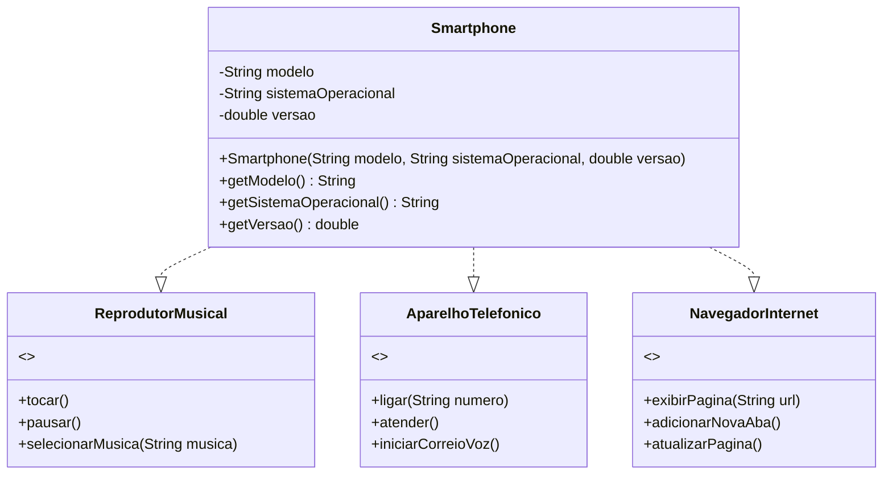

## Estrutura do Projeto

O projeto está organizado nos seguintes pacotes:

```
projeto-smartphone/
├── src/
│   ├── interfaces/
│   │   ├── ReprodutorMusical.java
│   │   ├── AparelhoTelefonico.java
│   │   └── NavegadorInternet.java
│   ├── dispositivos/
│   │   └── Smartphone.java
│   └── aplicacao/
│       └── Main.java
└── README.md
```

## Diagrama de Classes



## Descrição das Interfaces

### ReprodutorMusical
Interface que define os comportamentos básicos de um reprodutor de música.

Métodos:
- `tocar()`: Inicia a reprodução da música atual
- `pausar()`: Pausa a reprodução da música atual
- `selecionarMusica(String musica)`: Seleciona uma música específica para reprodução

### AparelhoTelefonico
Interface que define os comportamentos básicos de um aparelho telefônico.

Métodos:
- `ligar(String numero)`: Realiza uma ligação para o número especificado
- `atender()`: Atende uma chamada telefônica recebida
- `iniciarCorreioVoz()`: Inicia o serviço de correio de voz

### NavegadorInternet
Interface que define os comportamentos básicos de um navegador de internet.

Métodos:
- `exibirPagina(String url)`: Exibe uma página web a partir da URL especificada
- `adicionarNovaAba()`: Adiciona uma nova aba ao navegador
- `atualizarPagina()`: Atualiza (recarrega) a página atual

## Como Executar o Projeto

1. Certifique-se de ter o JDK (Java Development Kit) instalado em sua máquina
2. Clone este repositório:
   ```
   git clone https://github.com/usuario/projeto-smartphone.git
   ```
3. Navegue até o diretório do projeto:
   ```
   cd projeto-smartphone
   ```
4. Compile os arquivos Java:
   ```
   javac -d bin src/interfaces/*.java src/dispositivos/*.java src/aplicacao/*.java
   ```
5. Execute a aplicação:
   ```
   java -cp bin aplicacao.Main
   ```

## Saída Esperada

```
=== INFORMAÇÕES DO SMARTPHONE ===
Smartphone [modelo=Galaxy S21, sistema=Android, versão=13.0]

=== REPRODUTOR MUSICAL ===
🎵 Selecionando a música: Bohemian Rhapsody - Queen
▶️ Reproduzindo música...
⏸️ Música pausada.

=== APARELHO TELEFÔNICO ===
📞 Ligando para: (11) 98765-4321
📱 Atendendo chamada...
🔊 Iniciando correio de voz...

=== NAVEGADOR DE INTERNET ===
➕ Abrindo nova aba do navegador...
🌐 Exibindo página: https://www.exemplo.com.br
🔄 Atualizando página...
```

## Tecnologias Utilizadas

- Java (versão 8 ou superior)
- Conceitos de Programação Orientada a Objetos
- Interfaces Java
- Herança múltipla via interfaces